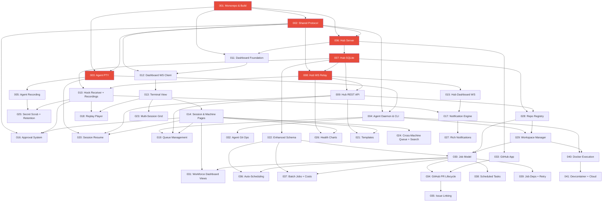

# Epic Dependency Graph

## Full Dependency Chain



## Critical Path

The longest dependency chain determines the minimum sequential work:

```
EPIC-001 → EPIC-002 → EPIC-008 → EPIC-009 → EPIC-028 → EPIC-029 → EPIC-030 → EPIC-034
  (build)   (types)    (ws relay)  (rest api)  (repos)    (workspaces) (jobs)    (github prs)
```

8 epics deep. Phase 1 has the most critical-path items (6 of the first 8).

## Parallelization Opportunities

### Phase 1 — After EPIC-001 + EPIC-002 complete:
- **Parallel track A:** EPIC-003 → EPIC-004 → EPIC-005 (Agent track)
- **Parallel track B:** EPIC-006 → EPIC-007 → EPIC-008 → EPIC-009 → EPIC-010 (Hub track)
- These two tracks are independent until EPIC-009 needs to send commands to agents

### Phase 2 — After Phase 1 core + EPIC-011:
- **Parallel track C:** EPIC-012 → EPIC-013 → EPIC-014 (Dashboard UI track)
- **Parallel track D:** EPIC-015 → EPIC-017 (Hub dashboard WS + notifications)
- **EPIC-016** (Approvals) needs both tracks to converge

### Phases 3-4 — High parallelism:
- EPIC-018 (Replay), EPIC-019 (Queue), EPIC-020 (Resume), EPIC-021 (Templates) are all independent

### Phases 5-8 — Sequential core with parallel extensions:
- EPIC-028 → EPIC-029 → EPIC-030 is sequential (repos → workspaces → jobs)
- After EPIC-030: EPIC-034, EPIC-036, EPIC-037, EPIC-038, EPIC-039 are all parallel
